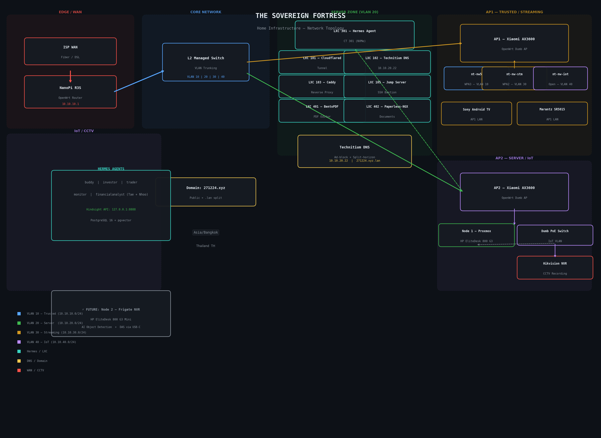

# 🏰 The Sovereign Fortress — Home Infrastructure

> Complete network and server infrastructure documentation for a smart home lab in Thailand.



## 📋 Table of Contents

- [Overview](#overview)
- [Network Architecture](#network-architecture)
- [Hardware Inventory](#hardware-inventory)
- [Proxmox Virtualization](#proxmox-virtualization)
- [Hermes Agent Platform](#hermes-agent-platform)
- [Rack Layout](#rack-layout)

---

## Overview

| | |
|---|---|
| **Location** | Thailand (Asia/Bangkok) |
| **Public Domain** | `271224.xyz` |
| **Local Domain** | `271224.xyz.lan` |
| **Network Philosophy** | VLAN-segmented, security-first, self-hosted |
| **Primary Compute** | HP EliteDesk 800 G3 Mini (x86, Intel QuickSync) |

### Network Summary

| VLAN | Subnet | Zone | Purpose |
|------|--------|------|---------|
| 10 | 10.10.10.0/24 | Trusted | Personal devices, management |
| 20 | 10.10.20.0/24 | Server | Proxmox, LXCs, infrastructure |
| 30 | 10.10.30.0/24 | Streaming | Media clients (TV, Marantz) |
| 40 | 10.10.40.0/24 | IoT | Smart home, CCTV, PoE devices |

---

## Network Architecture

### Topology Flow

```
ISP WAN
  └── NanoPi R3S (OpenWrt Router/Firewall)
        └── L2 Managed Switch (VLAN Trunking)
              ├── AP1 (Xiaomi AX3600 — Dumb AP)
              │     ├── LAN: Sony Android TV, Marantz SR5015
              │     └── WiFi:
              │           ├── "nt-nw5" (WPA3-PSK) → VLAN 10
              │           ├── "nt-nw-stm" (WPA2-PSK) → VLAN 30
              │           └── "nt-nw-iot" (Open) → VLAN 40
              │
              └── AP2 (Xiaomi AX3600 — Dumb AP)
                    ├── LAN Port 1: Node 1 (Proxmox — HP EliteDesk)
                    └── LAN Port 2: Dumb PoE Switch
                          └── Hikvision NVR (CCTV Recording)
```

### Edge Routing

- **Device:** NanoPi R3S
- **OS:** OpenWrt (standalone)
- **Role:** Core router, firewall, inter-VLAN routing
- **IP:** 10.10.10.1

### DNS Infrastructure

- **Server:** Technitium DNS at `10.10.20.22` (LXC 102)
- **Features:** Ad-blocking + split-horizon DNS
- **Public domain:** `271224.xyz` via Cloudflare Tunnels (LXC 101)
- **Internal domain:** `271224.xyz.lan` local resolution
- **Reverse Proxy:** Caddy (LXC 103) — translates external `.xyz` to internal `.lan`

### Wireless

| AP | Model | Role | SSIDs |
|----|-------|------|-------|
| AP1 | Xiaomi AX3600 | Entertainment zone | nt-nw5, nt-nw-stm, nt-nw-iot |
| AP2 | Xiaomi AX3600 | Server / IoT zone | (used as trunk for LXCs) |

Both APs run OpenWrt as dumb APs — no NAT, no DHCP (handled by router).

---

## Hardware Inventory

### Node 1 — Proxmox Virtualization Engine

| Spec | Detail |
|------|--------|
| **Model** | HP EliteDesk 800 G3 Mini |
| **CPU** | Intel x86 with QuickSync iGPU |
| **OS Drive** | 512GB Hiksemi E3000 M.2 NVMe SSD (`local-e3000-512gb`) |
| **Data Drive** | 1TB Samsung EVO 960 SATA SSD (`ssd-vault`) |
| **NIC 1** | Onboard 1 GbE → Proxmox management / Web GUI |
| **NIC 2** | Added 2.5 GbE → Production LAN bridge (all LXC traffic) |

### Node 2 — Frigate NVR (Planned)

| Spec | Detail |
|------|--------|
| **Model** | HP EliteDesk 800 G3 Mini (identical twin) |
| **Role** | Frigate NVR — local AI object detection for CCTV |
| **Storage** | Multi-bay SATA DAS enclosure via USB-C passthrough |

### Network Gear

| Device | Role | Location |
|--------|------|----------|
| NanoPi R3S | OpenWrt router/firewall | Rack |
| L2 Managed Switch | VLAN trunking, core switching | Rack |
| Xiaomi AX3600 (AP1) | Dumb AP — entertainment | Near living room |
| Xiaomi AX3600 (AP2) | Dumb AP — server zone | Near rack |
| Dumb PoE Switch | Powers CCTV cameras | Near rack |

### Connected Clients

| Device | Connection | VLAN |
|--------|-----------|------|
| Sony Android TV | AP1 LAN | Trusted (10) |
| Marantz SR5015 | AP1 LAN | Trusted (10) |
| Hikvision NVR | PoE Switch (AP2) | IoT (40) |

---

## Proxmox Virtualization

### LXC Inventory

All containers run on **Node 1** (HP EliteDesk). OS/root on NVMe unless noted.

| CT ID | Name | Purpose | Storage | Network |
|-------|------|---------|---------|---------|
| 101 | cloudflared | Cloudflare Tunnels (public → local) | NVMe | VLAN 20 |
| 102 | technitium | Local DNS (ad-block + split-horizon) | NVMe | 10.10.20.22 |
| 103 | caddy | Production reverse proxy (.xyz → .lan) | NVMe | VLAN 20 |
| 105 | jump-server | SSH bastion / management gateway | NVMe | VLAN 20 |
| **301** | **hermes-agent** | **AI agent platform (5 profiles)** | **NVMe** | **VLAN 20** |
| 401 | bentopdf | Self-hosted PDF editing | NVMe | VLAN 20 |
| 402 | paperless-ngx | Document management engine | NVMe root / 1TB SATA data | VLAN 20 |
| 403 | joplin-server | Private note sync backend | NVMe root / 1TB SATA data | VLAN 20 |

> **Note:** Heavy local LLM stacks (Ollama, Open WebUI) have been intentionally deprecated to preserve host compute resources.

### Storage Pools

| Pool | Disk | Size | Purpose |
|------|------|------|---------|
| `local-e3000-512gb` | Hiksemi E3000 NVMe | 512 GB | OS, LXC root filesystems |
| `ssd-vault` / `local-samsung-1tb` | Samsung EVO 960 SATA | 1 TB | App data, document storage, databases |

### Future

- **LXC 404 (CWA):** WebDAV container with ssd-vault bind-mount (pre-existing, repurposed)
- **Node 2 + DAS:** Frigate NVR with USB-C passthrough for CCTV recording

---

## Hermes Agent Platform

Runs in **LXC 301** on Proxmox Node 1.

### Profiles

| Profile | User(s) | Purpose | Model |
|---------|---------|---------|-------|
| **buddy** | Tae | Primary agent, orchestrator | minimax/m2.5-free |
| **investor** | Tae | Investment analysis, multi-model | various via OpenRouter |
| **trader** | Tae | Market monitoring | various via OpenRouter |
| **monitor** | Tae | Infrastructure monitoring | various via OpenRouter |
| **financialanalyst** | Tae + Nhoo | Shared investment analysis | gemma-4-31b-it:free |

### Memory System

- **Provider:** Self-hosted Hindsight API (`127.0.0.1:8888`)
- **Mode:** `local_external` with external PostgreSQL 16 + pgvector
- **Storage:** `ssd-vault` (dedicated volume)
- **Banks:** Per-user isolation via Telegram ID mapping
- **Status:** Fully self-hosted, **zero paid services** (Honcho decommissioned)

### Infrastructure Services

| Service | Telegram ID | Role |
|---------|-------------|------|
| Tae | `2135517501` | Primary user, all profiles |
| Nhoo | `8748834444` | Wife, FA profile access |
| FA Bot | `8897627710` | Financial analyst profile |

---

## Rack Layout (12U Cabinet)

```
[1U]  PDU (Power Distribution Unit)
[1U]  Blank Patch Panel (Cat6 CCTV drops)
[1U]  L2 Managed Switch
[1U]  Cantilever Shelf: ISP Modem + NanoPi R3S Router
[1U]  Cantilever Shelf: Node 1 + Node 2 HP Minis
[3U]  4-Point Shelf: DAS Storage Tower Enclosure
[1U]  Cantilever Shelf: Dumb PoE Switch (CCTV)
[1U]  Blank Ventilation / Airflow Panel
[2U]  UPS (Battery Backup) — base
```

### Cabinet Specs

- **Height:** 12U vertical
- **Min Depth:** 600mm (for DAS cable clearance + ventilation)
- **DAS Mounting:** Vertical orientation (hard drive platter health) with 4-point bridge shelf to prevent sagging

---

## 🔗 See Also

- [Network Topology](network-topology.md) — Detailed VLAN and subnet breakdown
- [Hardware Inventory](hardware-inventory.md) — Full bill of materials
- [Proxmox LXC Inventory](proxmox-lxc-inventory.md) — Container specs and configs

---

*Last updated: 2026-06-01*
